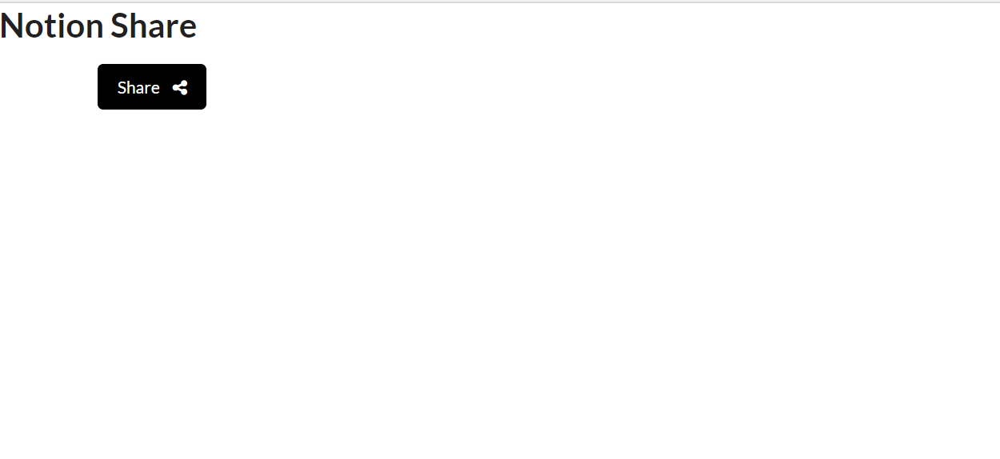
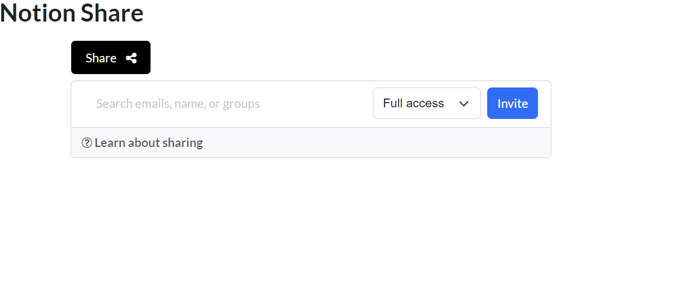

# Notion Share
A reusable share widget like that of Notion. 

**Link to Project**  https://notionshare.netlify.app/

**Features** 
- Responsive and re-usable Notion share widget
- Share to individuals, groups, or everyone.
- Use email or name to share the notion page.
- Manage access permissions of individuals and groups.
- Update access permissions as many times as needed.

**Screenshots**

**How to run**
- Clone the project.
- Run in Vscode or any IDE of your preference.
- Run the project in the Browser of your preference.

**Optimizations**
- Add profile image to the people and groups.
- List info can be stored and fetched from the backend. 

