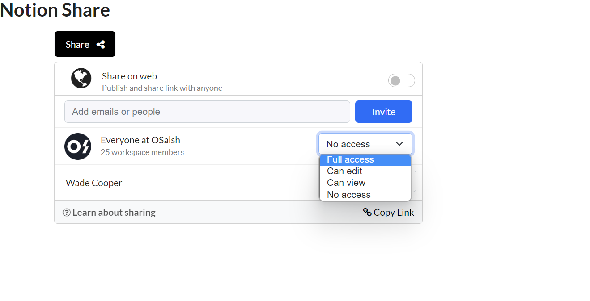

# Notion Share
A responsive & reusable share widget like that of Notion. 

**Link to Project**  https://notionshare.netlify.app/

**Unique Features** 
- Fully responsive to different viewport sizes.
- Can add NEW people/group dynamically (new people/group will appear in "Others..." section of the list).
- Users are removed from main-view if permission updated to "no access".
- Manage access permissions for multiple users at the same time.
- Manage access permissions for individual users separately.
- Individual permission stays updated even if navigated to different a view.
- Copy the link to your clipboard with a single click.

**Screenshots**

**How to run**
- Clone the project.
- Run in Vscode or any IDE of your preference.
- Run the project in the Browser of your preference.

**Optimizations
- Add profile image to the people and groups.
- List info can be stored and fetched from the backend. 

